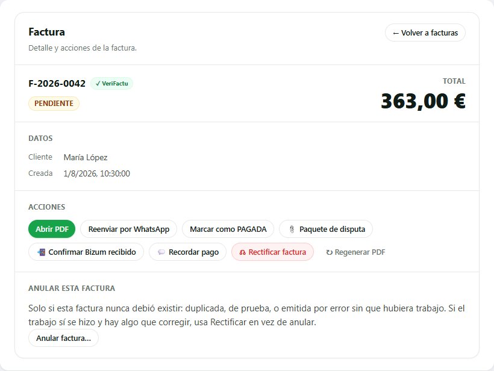
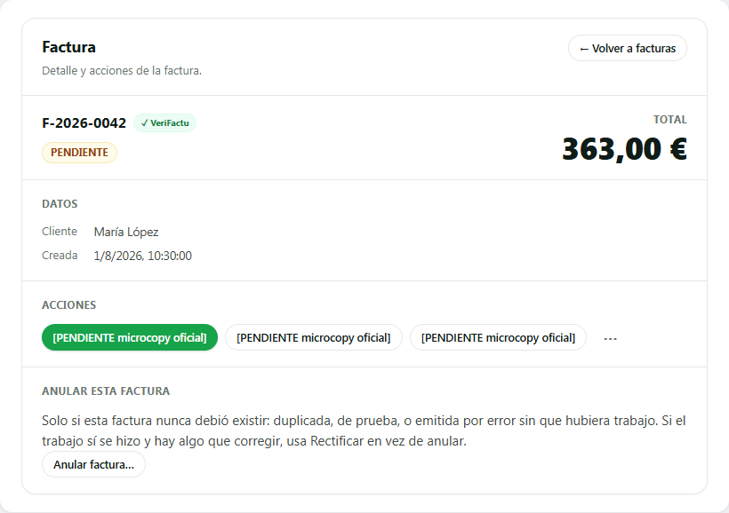
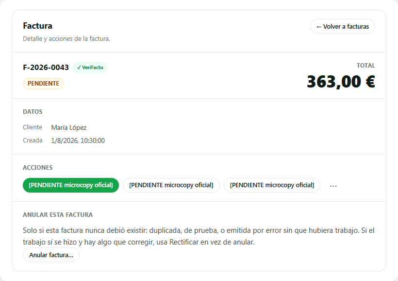
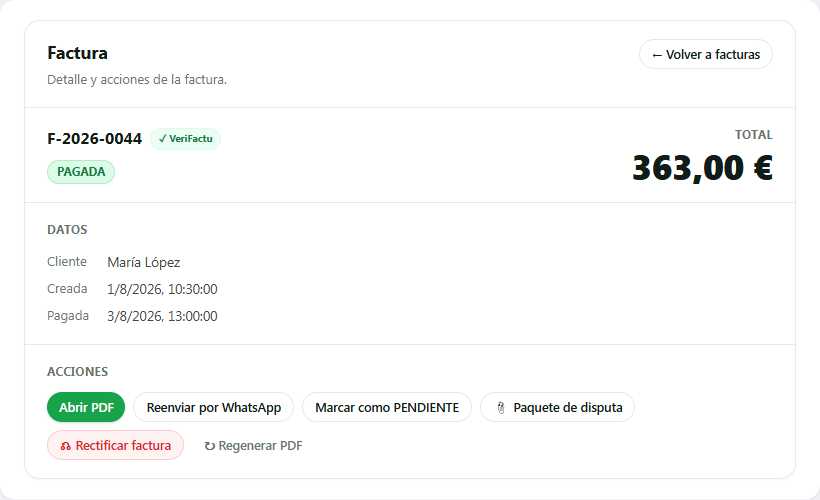
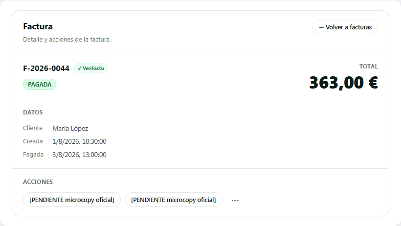
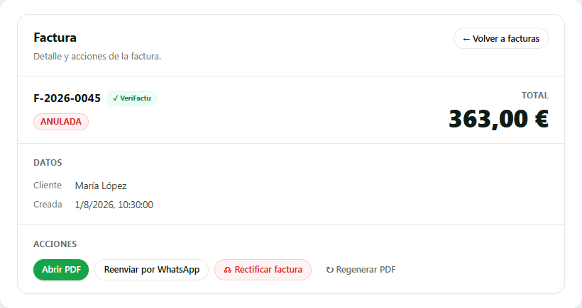
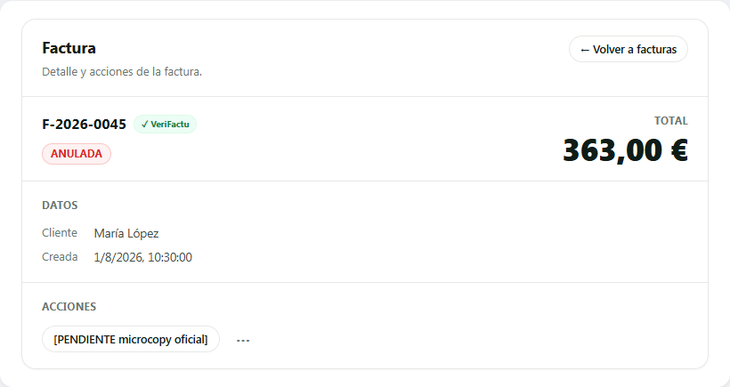
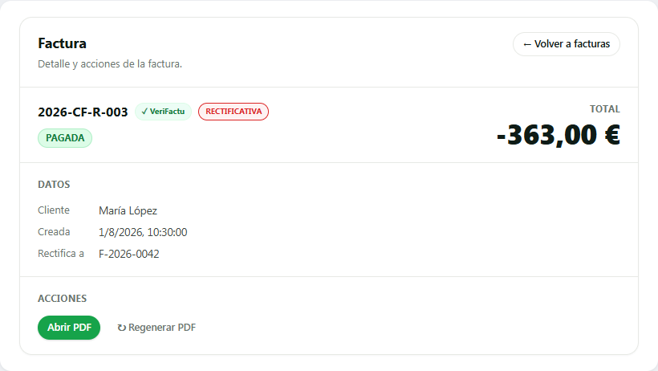
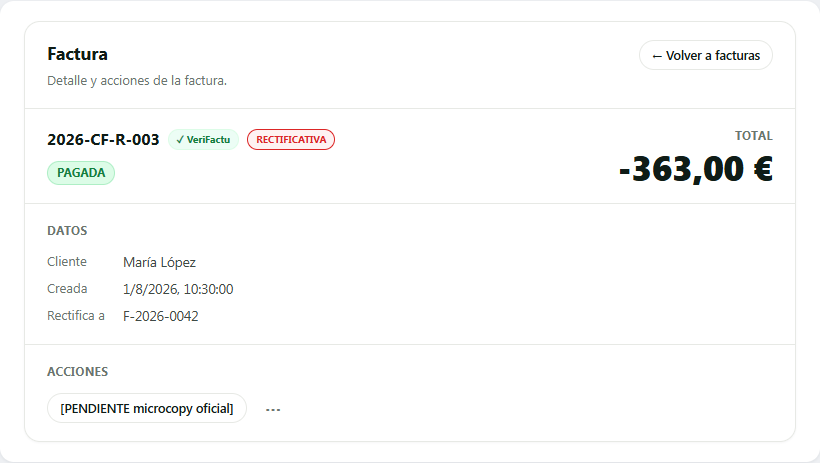

# SCRUM-283 · B2 — capturas antes/después de la vista de factura (AB6)

Producidas con un **harness aislado** (Playwright sobre un servidor estático local): se cargan
`api.js` + `invoiceActionsRegistry.js` + la vista, se stubea `fetch` con un `invoice` de mentira y se
renderiza `renderInvoiceDetailView` en cada estado. **Sin BD, sin auth, sin producción.** El «antes»
usa la vista PRE-B2 (`eebc191`); el «después», la de `main` (post-B2).

Lo que hay que ver: el **antes** son 8 botones planos del mismo peso (ninguno dice el siguiente paso);
el **después** es **1 primaria + ≤2 secundarias + «⋮»**, por estado. Los rótulos del después son el
marcador `[PENDIENTE microcopy oficial]` (regla 30): el microcopy lo aprueba el fundador.

## pending — con cobro en vuelo (`chargeId`)

La primaria es contextual: con `chargeId`, el siguiente paso es **Confirmar Bizum** (primaria verde).

| Antes (8 botones planos) | Después (1 + 2 + ⋮) |
| --- | --- |
|  |  |

## pending — sin cobro en vuelo

Sin `chargeId`, la primaria es **Marcar como pagada** (el otro ocupante del mismo slot; ninguna desaparece).

| Después (sin cobro) |
| --- |
|  |

## paid

Sin primaria; «Marcar como PENDIENTE» baja al «⋮».

| Antes | Después |
| --- | --- |
|  |  |

## annulled

Sin primaria, solo PDF de secundaria, y **Rectificar NO se pinta** (SCRUM-308). Anular no aplica (solo pending).

| Antes | Después |
| --- | --- |
|  |  |

## R1 (rectificativa)

Sin primaria, solo PDF de secundaria, solo Regenerar en el «⋮».

| Antes | Después |
| --- | --- |
|  |  |

---

**Pendiente (humano, del fundador, por bloque):** la matriz de dispositivos reales (Android gama media /
iPhone / tablet, V0-5). Es el único punto de AB6 que queda; no bloquea el merge.
