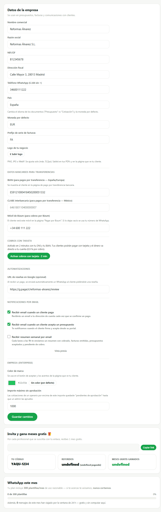
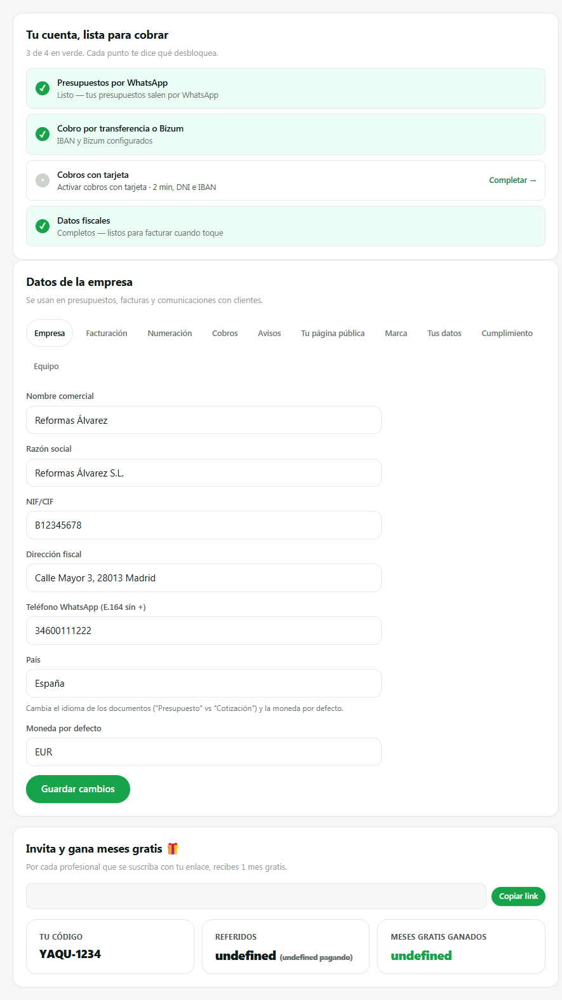
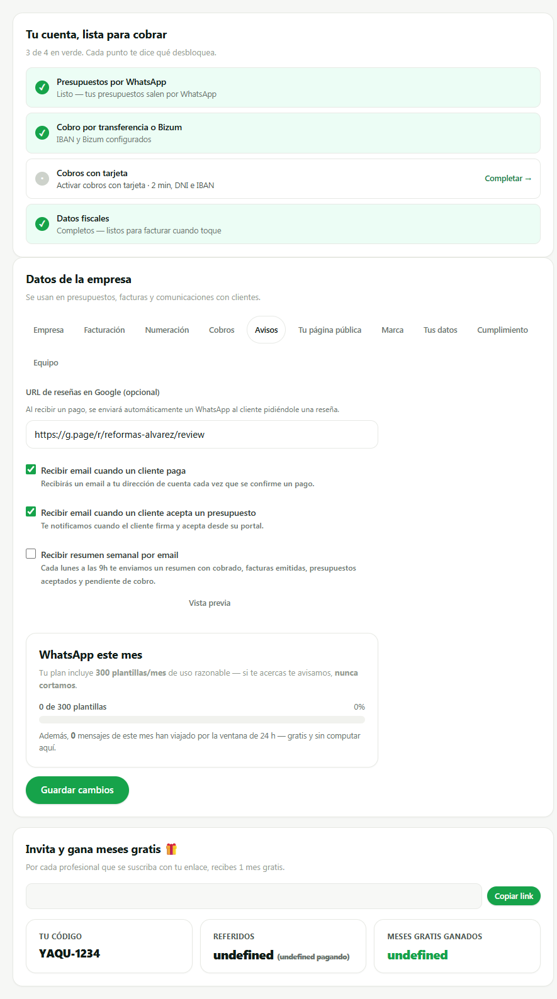
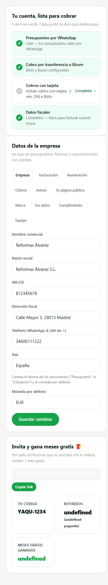

# SCRUM-284 · capturas de Configuración troceada en diez submenús (AB6)

**Medido contra:** `origin/main` = `c2be01e9347a2b0b761e764de7033f322f820f85` · 2026-08-05T06:25:00+01:00

Producidas con un **harness aislado** (Playwright sobre un servidor estático efímero): se cargan
`api.js` + `settingsSubmenus.js` + `settingsView.js`, se stubea `apiRequest` con un merchant de
mentira y se llama a `renderSettingsView`. **Sin BD, sin auth, sin servidor de la app, sin
producción.** El harness no se commitea: vivió en el scratchpad y el servidor se paró al terminar.

El **antes** no es una reconstrucción: son los bytes de `settingsView.js` en `origin/main`, servidos
tal cual.

⚠️ **Un fixture equivocado casi me deja probar de menos, y lo dejo escrito porque es la parte útil:**
la primera pasada mandaba `profileSlug` y `renderPublicProfileCard` sale por `if (m.slug ===
undefined) return`. La tarjeta no se pintaba **ni en el antes ni en el después**, así que la
comparación parecía correcta y en realidad no estaba mirando los seis `pp-*`/`qr-*`. Se midió la
condición en el código en vez de suponerla, y con `slug` la tarjeta aparece.

## ANTES — un scroll con doce asuntos distintos



Datos de empresa, bancarios, Connect, reseñas, notificaciones, marca y aprobaciones, uno detrás de
otro con separadores; y debajo, sueltas, «Invita y gana» y «WhatsApp este mes».

## DESPUÉS — diez submenús, y la cabecera fuera de ellos



El índice de estado («Tu cuenta, lista para cobrar») queda **en la cabecera, fuera de los diez**: no
es una superficie de Configuración, es un índice cuyos tres elementos son **referencias** a campos
que ya viven en Empresa y en Cobro.

## AVISOS — donde se ven las dos decisiones



* **`googleReviewUrl` vive aquí**, por el criterio del fundador: *el destino de un ajuste sale de lo
  que gobierna, no de dónde se ve su efecto*. El campo configura el envío automático; la ficha
  pública y la página de recibo solo lo consumen.
* **«WhatsApp este mes» es un bloque informativo dentro de Avisos**, fuera del mapa y fuera del
  guard: es un contador de consumo y no persiste nada.
* **«Invita y gana» ya no está en ningún panel** — pero sí al final de la pantalla, fuera de los
  diez, con colocación **provisional declarada** hasta el incremento 2 (ver más abajo).

## El reparto, medido en el navegador (no leído del código)

| submenú | controles |
|---|---|
| empresa | `name` `legalName` `taxId` `address` `whatsappPhone` `country` `defaultCurrency` |
| facturacion | — *(vacío declarado)* |
| numeracion | `invoiceSeriesPrefix` |
| cobro | `iban` `clabe` `bizumPhone` |
| avisos | `googleReviewUrl` `notifyEmailOnPaid` `notifyEmailOnQuoteAccepted` `notifyEmailWeeklyDigest` |
| publica | `pp-slug` `pp-zones` `pp-years` `qr-formato` `qr-size` `qr-dark` |
| marca | `logoUrl` `brand-color-input` |
| datos | — *(vacío declarado)* |
| cumplimiento | — *(vacío declarado)* |
| equipo | `approvalThreshold` |

**24 controles + `ref-link` (fuera de Configuración) = los 25 del censo. Cero duplicados, cero
perdidos.** Los tres paneles vacíos son exactamente los tres declarados. Ningún ajuste desapareció
en la reorganización, que es el fallo mudo que el ticket nombra.

## 390 px — con los RÓTULOS REALES



**Aquí está el motivo de aprobar los rótulos antes de capturar.** Con el marcador (28 caracteres) las
diez pestañas caían **una por fila**, así que la captura anterior medía el marcador y no la pantalla.
Con los textos aprobados, medido en el navegador a 390 px:

```
fila 1  Empresa · Facturación · Numeración
fila 2  Cobros · Avisos · Tu página pública
fila 3  Marca · Tus datos · Cumplimiento
fila 4  Equipo
```

**Cuatro filas (3+3+3+1)**, pestaña más ancha 124 px, **44 px** de alto todas (AB6 · objetivo al
pulgar; `btn-sm` se queda en 30) y `scrollWidth === clientWidth`: **no desborda en X**.

**No hay problema de layout: era el marcador.** Por eso no sale hallazgo ni ticket — se midió con el
texto real antes de decidirlo.

---

**Los diez rótulos están APROBADOS** por el fundador (5-ago-2026) y fijados carácter a carácter en
`tests/scrum284-configuracion-submenus.test.mjs`: cambiar uno sale rojo. No eran redacción nueva —
los nueve primeros vienen escritos en la descripción del ticket y el décimo es el nombre que usó el
fundador al colocar `approvalThreshold`.

**El estado vacío SÍ sigue con el marcador**, y la diferencia importa: «aquí todavía no hay nada» no
está escrito en ninguna parte, así que es microcopy nueva y la aprueba el fundador.

## «Invita y gana»: colocación PROVISIONAL, declarada

Se sigue pintando al final de Configuración, **fuera de los diez paneles**, hasta que el incremento 2
le dé su entrada en la barra lateral. No se deja sin llamar entre un incremento y otro porque el
programa **paga un mes gratis al referidor**: dejarlo inalcanzable «solo durante un PR» es una
regresión de dinero, y «temporal» es exactamente como se quedan las cosas. Está en
`SUPERFICIES_PROVISIONALES` con lo que la sustituye, y hay guard que exige las dos mitades: que la
provisional esté declarada **y que se siga pintando**.

---

**HUECO PENDIENTE (humano, del fundador, por bloque):** la **matriz de dispositivos reales**
(Android gama media / iPhone / tablet, V0-5). No se finge y no se da por hecha: estas capturas son de
un navegador de escritorio redimensionado, que no sustituye a un dispositivo real.
