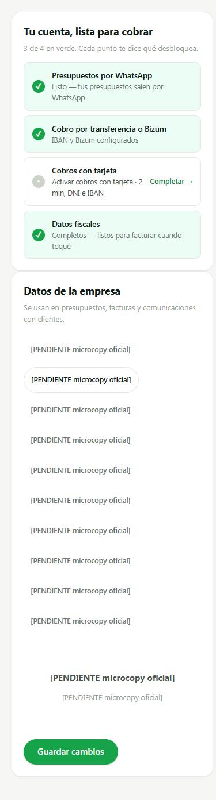

# SCRUM-284 · capturas de Configuración troceada en diez submenús (AB6)

**Medido contra:** `origin/main` = `077fa8ac24d7e832d446a589b31367e9c15de916` · 2026-08-05T06:12:00+01:00

Producidas con un **harness aislado** (Playwright sobre un servidor estático efímero): se cargan
`api.js` + `settingsSubmenus.js` + `settingsView.js`, se stubea `apiRequest` con un merchant de
mentira y se llama a `renderSettingsView`. **Sin BD, sin auth, sin servidor de la app, sin
producción.** El harness no se commitea: vivió en el scratchpad y el servidor se paró al terminar.

El **antes** no es una reconstrucción: son los bytes de `settingsView.js` en `origin/main`, servidos
tal cual.

⚠️ **Un fixture equivocado casi me deja probar de menos, y lo dejo escrito porque es la parte útil:**
la primera pasada mandaba `profileSlug` y `renderPublicProfileCard` sale por `if (m.slug ===
undefined) return`. La tarjeta no se pintaba **ni en el antes ni en el después**, así que la
comparación parecía correcta y en realidad no estaba mirando los seis `pp-*`/`qr-*`. Se midió la
condición en el código en vez de suponerla, y con `slug` la tarjeta aparece.

## ANTES — un scroll con doce asuntos distintos

Datos de empresa, bancarios, Connect, reseñas, notificaciones, marca y aprobaciones, uno detrás de
otro con separadores; y debajo, sueltas, «Invita y gana» y «WhatsApp este mes».

## DESPUÉS — diez submenús, y la cabecera fuera de ellos

El índice de estado («Tu cuenta, lista para cobrar») queda **en la cabecera, fuera de los diez**: no
es una superficie de Configuración, es un índice cuyos tres elementos son **referencias** a campos
que ya viven en Empresa y en Cobro.

## AVISOS — donde se ven las dos decisiones

* **`googleReviewUrl` vive aquí**, por el criterio del fundador: *el destino de un ajuste sale de lo
  que gobierna, no de dónde se ve su efecto*. El campo configura el envío automático; la ficha
  pública y la página de recibo solo lo consumen.
* **«WhatsApp este mes» es un bloque informativo dentro de Avisos**, fuera del mapa y fuera del
  guard: es un contador de consumo y no persiste nada.
* **«Invita y gana» ya no está** en ninguna parte de Configuración.

## El reparto, medido en el navegador (no leído del código)

| submenú | controles |
|---|---|
| empresa | `name` `legalName` `taxId` `address` `whatsappPhone` `country` `defaultCurrency` |
| facturacion | — *(vacío declarado)* |
| numeracion | `invoiceSeriesPrefix` |
| cobro | `iban` `clabe` `bizumPhone` |
| avisos | `googleReviewUrl` `notifyEmailOnPaid` `notifyEmailOnQuoteAccepted` `notifyEmailWeeklyDigest` |
| publica | `pp-slug` `pp-zones` `pp-years` `qr-formato` `qr-size` `qr-dark` |
| marca | `logoUrl` `brand-color-input` |
| datos | — *(vacío declarado)* |
| cumplimiento | — *(vacío declarado)* |
| equipo | `approvalThreshold` |

**24 controles + `ref-link` (fuera de Configuración) = los 25 del censo. Cero duplicados, cero
perdidos.** Los tres paneles vacíos son exactamente los tres declarados. Ningún ajuste desapareció
en la reorganización, que es el fallo mudo que el ticket nombra.

## 390 px — un vacío declarado

Un submenú vacío **dice que está vacío** en vez de dejar un panel en blanco que parezca roto: «un
menú que lleva a una página vacía es peor que no tener el menú». Medido a este ancho:
`scrollWidth === clientWidth`, **no desborda en X**, y las diez pestañas miden **44 px** de alto
(AB6 · objetivo al pulgar; `btn-sm` se queda en 30).

---

**Los diez rótulos son `[PENDIENTE microcopy oficial]`** (regla 30), con guard. Por eso las capturas
se leen raro: es el marcador ocupando los diez nombres, no el diseño.

⚠️ **OBSERVACIÓN, no arreglada a propósito:** a 390 px las diez pestañas caen **una por fila**,
porque el marcador son 28 caracteres — más que cualquier rótulo final plausible («Empresa»,
«Cobros»…). Con los textos aprobados se agruparán en tres o cuatro filas. **Se declara en vez de
arreglarse**: ajustar el layout contra un texto que va a ser sustituido es optimizar para lo que no
se va a quedar. Quien aterrice la microcopy tiene que volver a mirar esta barra con los textos reales.

---

**HUECO PENDIENTE (humano, del fundador, por bloque):** la **matriz de dispositivos reales**
(Android gama media / iPhone / tablet, V0-5). No se finge y no se da por hecha: estas capturas son de
un navegador de escritorio redimensionado, que no sustituye a un dispositivo real.
