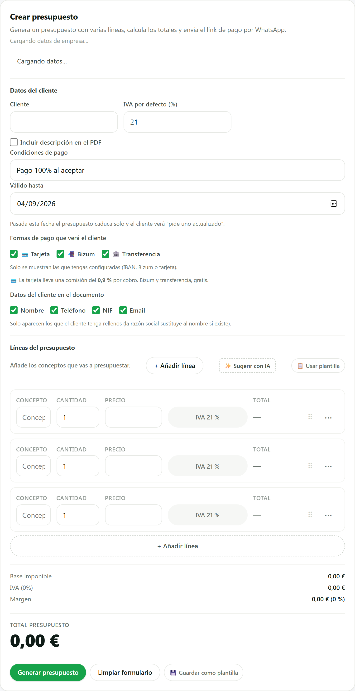
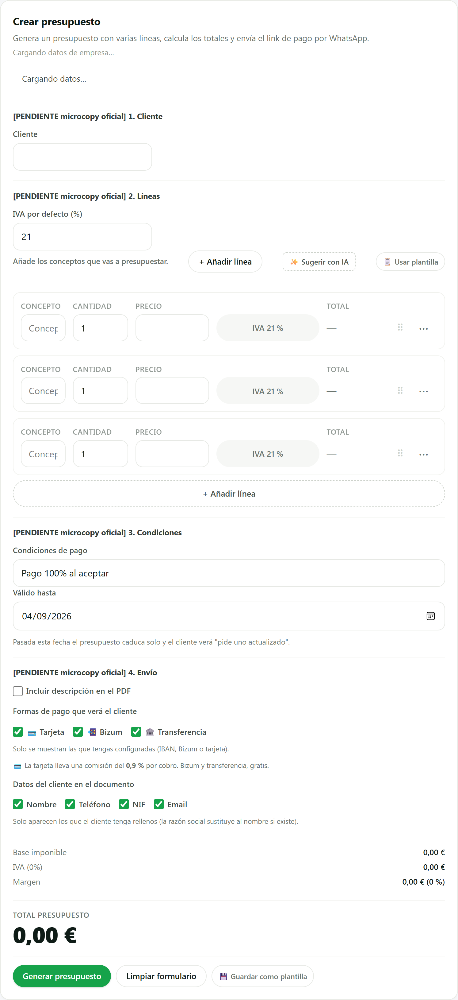
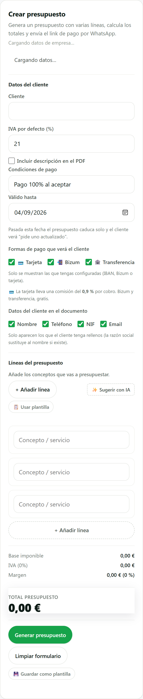
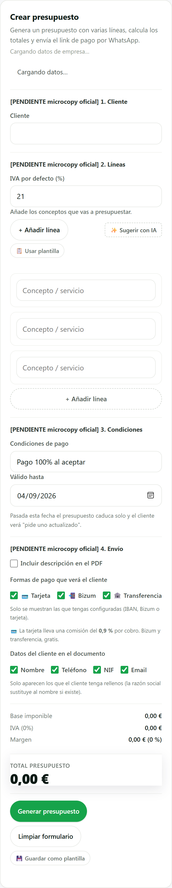
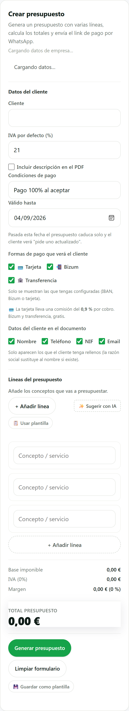
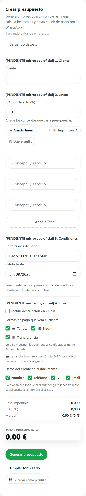

# SCRUM-286 · capturas del formulario «Nuevo presupuesto» (AB6)

**Medido contra:** `origin/main` = `c2be01e9347a2b0b761e764de7033f322f820f85` · 2026-08-05T06:00:31+01:00

Producidas con un **banco aislado** (puppeteer-core sobre el Edge instalado + servidor estático
efímero sirviendo `public/`). La página llama a la función **real** `renderQuotesView(container, null)`
con `tokens.css` y `dashboard/css/styles.css` de verdad. **Sin BD, sin auth, sin servidor de la app,
sin producción.** El banco no se commitea: vivió en el scratchpad, y la página del banco se sirvió
desde una ruta virtual para no escribir nada dentro de `public/`.

> El banco **arranca con un suelo**: si `.quote-block` no computa `border-top: 1px` y
> `.quote-block-title` no computa `font-weight: 700`, para y **no informa**. Está copiado de
> SCRUM-350, donde la primera tanda dio «no desborda» en los diez pies porque la página se pintaba
> **sin CSS**. Una captura plausible y una captura cierta se parecen demasiado.

El ANTES se sirve desde el blob exacto de `origin/main`
(`6239251d2014369fad982514d55b2a7326607e0c`, verificado con `git hash-object`), no desde una copia
reescrita: PowerShell recodifica los acentos al redirigir, y este fichero tiene «Líneas» y «Envío».

## 🔴 Lo que el banco midió, y contradice al ticket

El ticket dice que el formulario «empieza por *Estación de calor* y las condiciones de pago, y las
líneas **y el cliente** vienen después». El banco lee el DOM real y devuelve el orden de los
controles con `name`:

| | orden real de los controles |
|---|---|
| **ANTES** | `customer_id` → `vat_default` → `include_description` → `payment_terms` |
| **DESPUÉS** | `customer_id` → `vat_default` → `payment_terms` → `include_description` |

**El cliente ya era lo PRIMERO**, en las dos. Lo que sí era cierto es la otra mitad: las
condiciones de pago, la caducidad, las formas de pago y los datos del documento se pintaban
**antes que las líneas**. Los **siete controles de cuatro asuntos distintos** vivían dentro de un
único bloque titulado «Datos del cliente» — un título que mentía sobre su contenido.

Coincide con lo derivado por AST en `tests/_orden-pintado-presupuesto.mjs`: dos medidas
independientes (árbol estático y DOM en navegador) dando lo mismo.

## Títulos de bloque

| | bloques con título |
|---|---|
| **ANTES** | `Datos del cliente` · `Líneas del presupuesto` |
| **DESPUÉS** | `[PENDIENTE microcopy oficial] 1. Cliente` · `… 2. Líneas` · `… 3. Condiciones` · `… 4. Envío` |

Los cuatro rótulos son **microcopy sin aprobar** (regla 30) y salen con el marcador, igual que
SCRUM-284/B1. `tests/scrum286-bloques-orden.test.mjs` falla si un título se escribe directo.

## 1280 px — escritorio

| ANTES | DESPUÉS |
|---|---|
|  |  |

## 390 px — iPhone estándar

| ANTES | DESPUÉS |
|---|---|
|  |  |

## 360 px — Android gama media, donde aprieta

| ANTES | DESPUÉS |
|---|---|
|  |  |

## Lo que NO cambia de tamaño

`IVA por defecto (%)` sale del bloque del cliente y entra en el de Líneas. Va dentro de su propia
`.quote-form-row` **a propósito**: esa clase es una rejilla de tres columnas que a ≤900 px pasa a
una. Así el campo conserva el ancho de un tercio que ya tenía en escritorio y el ancho completo en
móvil — el reordenado no lleva dentro un cambio de tamaño sin declarar.

No se ha añadido ni una regla de CSS: los cuatro bloques usan `.quote-block` y
`.quote-block-title`, que ya existían (`styles.css:1022-1023`). No nace un segundo lenguaje visual.

## Por qué las capturas siguen valiendo tras rebasar

Se generaron sobre `077fa8ac` y la base final es `c2be01e9`. Los tres ficheros que entraron en
medio son `docs/master/SCRUM-284.md`, `tests/_asignacion-submenus.mjs` y
`tests/scrum284-asignacion-submenus.test.mjs`: **ninguno toca `quotesView.js` ni el CSS**, así que
no hay nada que volver a pintar. Queda dicho en vez de darse por supuesto.

---

**HUECO PENDIENTE (humano, del fundador, por bloque):** la **matriz de dispositivos reales**
(Android gama media / iPhone / tablet, V0-5). No se finge y no se da por hecha: estas capturas son
de un navegador de escritorio redimensionado a 1280, 390 y 360 px, y **eso no sustituye a un
dispositivo real** — ni al teclado numérico que abre `IVA por defecto` en móvil, ni al selector de
fecha nativo de `Válido hasta`.
