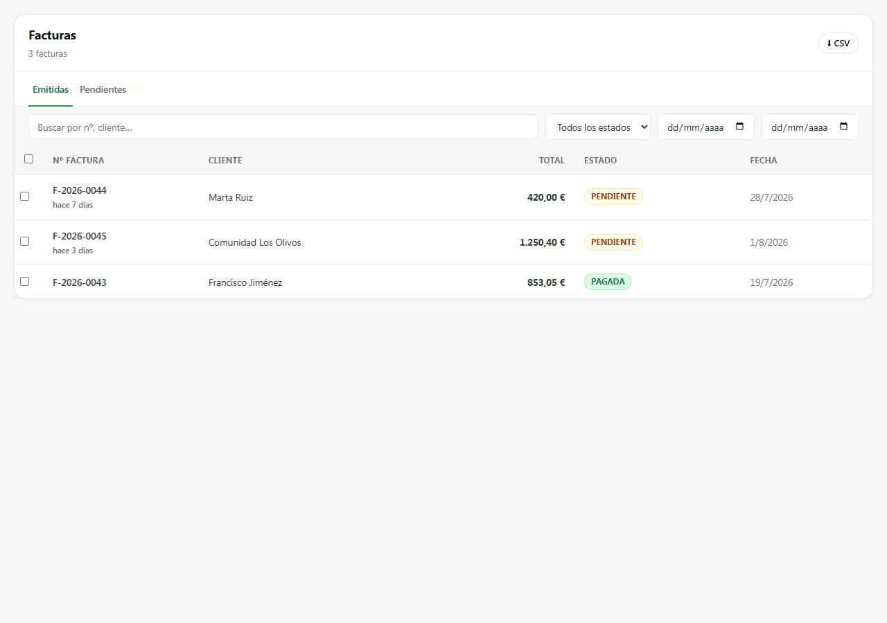
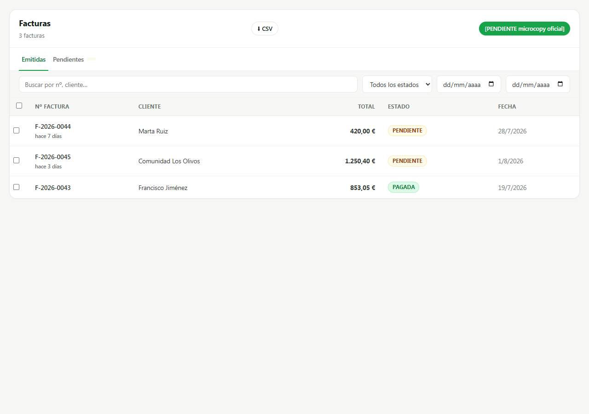
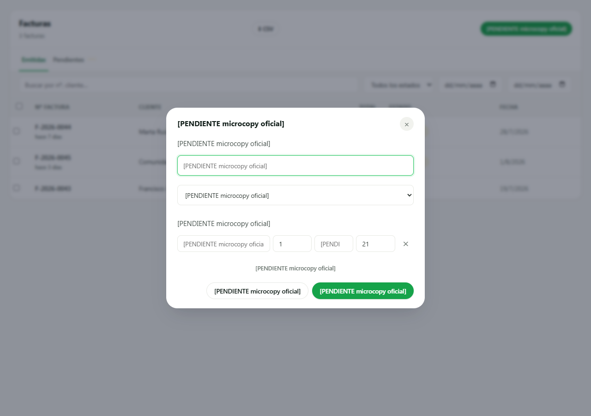
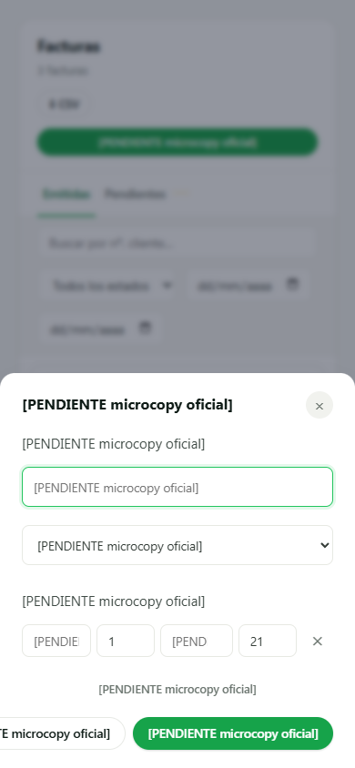

# SCRUM-289 · A0.3 — capturas de la factura suelta (AB6)

**Medido contra:** `origin/main` = `3e6f63709d40c7781317a90523208872e2fb5605` · 2026-08-05T04:53:16+01:00

Producidas con un **harness aislado** (Playwright sobre un servidor estático efímero): se cargan
`api.js` + `invoiceActionsRegistry.js` + `invoicesView.js` + `nuevaFacturaModal.js`, se stubea
`fetch` con facturas y clientes de mentira y se llama a `renderInvoicesView`. **Sin BD, sin auth,
sin servidor de la app, sin producción.** El harness no se commitea: vivió en el scratchpad y el
servidor se paró al terminar.

**El estado del gate se inyecta, no se recalcula.** El harness pone
`window.appFacturaSueltaDisponible` a `true`/`false` por query param — que es exactamente lo que
`/admin/me` le diría al navegador. El harness **no reimplementa el criterio**: solo inyecta su
resultado, igual que hace el front en producción.

## Gate CERRADO — el merchant no emite factura, así que no hay botón

Es lo que ve **hoy cualquier merchant ES real** (`getEmissionMode` → `'receipt'`, regla 24). No hay
botón, no hay aviso, no hay nada que explicar: la puerta sencillamente no existe.

## Gate ABIERTO — el botón aparece en la cabecera

Modo `fiscal` o `demo`. El botón entra **junto a `⬇ CSV`**, sin tocar nada más de la pantalla
(regla 4: una pantalla por cambio, y el listado de Facturas no se rediseña aquí).

## El modal, con el selector de cliente

El selector se llena del endpoint que YA existe (`GET /admin/customers?search=`), que resuelve por
`req.merchantId`: la tenencia la garantiza el servidor, no el `<select>`.

**Todos los rótulos son `[PENDIENTE microcopy oficial]`** (regla 30): el microcopy lo aprueba el
fundador, y hay guard en la suite que lo exige. Los únicos textos reales son los **nombres de
cliente**, que son dato del merchant y no copy.

Comprobado en el árbol de accesibilidad que **el nombre accesible de los glifos `×` y `✕` también es
el marcador** — que es la razón por la que el guard los excluye de la población de literales: son
iconos, su texto es el `aria-label`, y ese sí lo vigila.

## 390 px — hoja inferior

Por debajo de 640 px `.modal-overlay .modal` ya es hoja inferior full-width (styles.css), y el modal
la hereda sin CSS propio.

⚠️ **OBSERVACIÓN, no arreglada a propósito:** a 390 px **los dos botones del pie no caben y se
salen**. Es un efecto del marcador —28 caracteres, más largo que cualquier rótulo final plausible—,
pero deja ver que `.modal-footer` no envuelve. **Se declara en vez de arreglarse**: ajustar el
layout contra un texto que va a ser sustituido es optimizar para lo que no se va a quedar. Quien
aterrice la microcopy aprobada tiene que volver a mirar este pie con los textos reales.

---

**HUECO PENDIENTE (humano, del fundador, por bloque):** la **matriz de dispositivos reales**
(Android gama media / iPhone / tablet, V0-5). No se finge y no se da por hecha: estas capturas son
de un navegador de escritorio redimensionado, que no sustituye a un dispositivo real.
