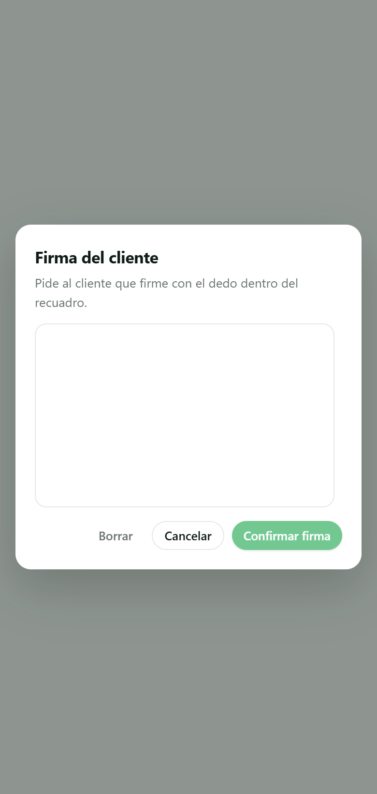
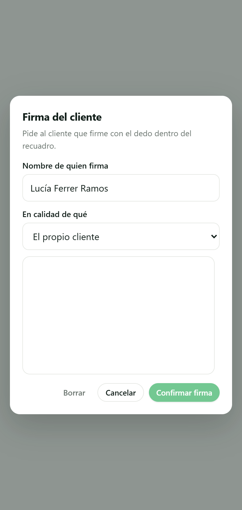
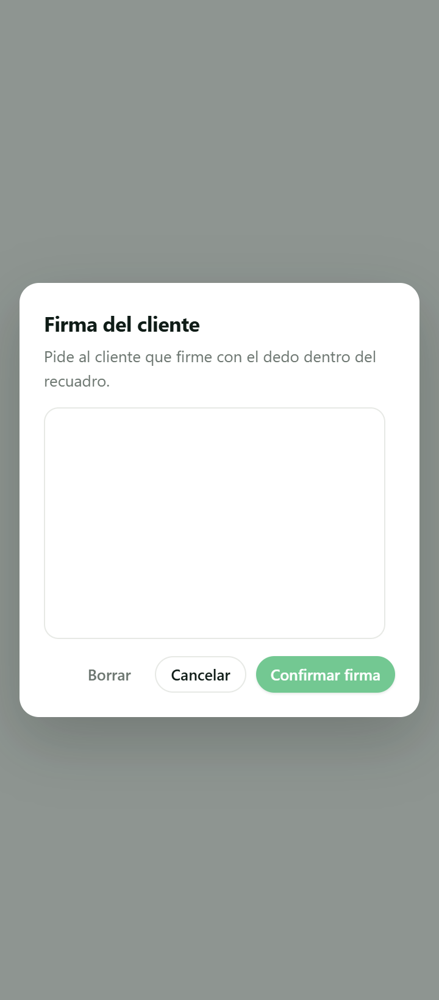
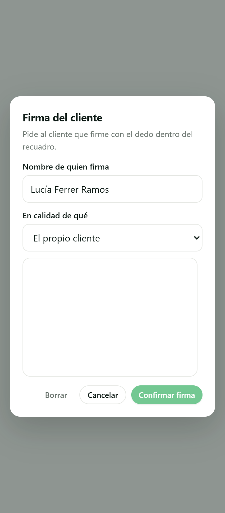

# SCRUM-300 · capturas del modal de firma en obra (AB6)

**Medido contra:** `origin/main` = `077fa8ac24d7e832d446a589b31367e9c15de916` · 2026-08-05T04:51:37Z

Producidas con un **banco aislado** (puppeteer-core sobre el Edge instalado + servidor estático
efímero sirviendo `public/`). El modal se monta con `tokens.css` y `dashboard/css/styles.css` de
verdad, y las cinco ranuras se inyectan **leyéndolas del módulo compilado** (`albaranFirmante.js`),
no tecleadas — igual que las recibe el navegador por `/admin/me`. **Sin BD, sin auth, sin servidor
de la app, sin producción.** El banco no se commitea: vivió en el scratchpad.

> El banco **arranca con un suelo**: si `--ink` no resuelve desde `tokens.css`, para y no informa.
> Sin CSS el modal se pinta con los *fallbacks* en línea (`var(--surface,#fff)`), y entonces «se ve
> bien» y «no supe montarlo» dan la misma captura. Medido en las cuatro tomas: `--ink = #0f1c17`,
> 3 hojas de estilo cargadas.

## Lo que cambia

Dos campos nuevos **encima del canvas**, los dos precargados con el caso mayoritario: el nombre con
el del cliente y la calidad con «El propio cliente».

| | ANTES | DESPUÉS |
|---|---|---|
| **390 px** — iPhone estándar |  |  |
| **360 px** — donde aprieta |  |  |

Medido por el banco en las cuatro tomas:

| | campos | alto del modal | canvas | ¿desborda? |
|---|---|---|---|---|
| ANTES 390 | 0 | 356 px | 190 px | no |
| ANTES 360 | 0 | 356 px | 190 px | no |
| DESPUÉS 390 | 3 | 513 px | **190 px** | no |
| DESPUÉS 360 | 3 | 513 px | **190 px** | no |

Los tres campos son el nombre, el desplegable y el de texto libre (**oculto** hasta elegir «Otro»,
por eso solo se ven dos rótulos). **El canvas NO encoge**: sigue midiendo 190 px de alto en los dos
anchos, que es la propiedad que importa — la firma es el gesto, y estrecharlo para hacer sitio a los
campos habría empeorado justo lo que la 300 viene a reforzar.

El desplegable sirve las cinco ranuras aprobadas, verificado en la captura:
«El propio cliente» · «Un familiar o alguien que vive en el domicilio» · «Personal de la obra» ·
«Portero o conserje del edificio» · «Otro».

## El coste en toques: 3 → 3

| | Antes | Después |
|---|---|---|
| Caso mayoritario (firma el cliente) | `Firmar` → trazo → `Confirmar firma` | **igual** |
| Firma otra persona | — | + abrir el desplegable, + elegir (+ teclear si es «Otro») |

**2 toques + 1 trazo, sin cambio**, porque los dos campos llegan rellenos con lo que pasa casi
siempre. Solo paga quien firma siendo otra persona, que es exactamente el caso que el documento
necesitaba capturar y hasta hoy perdía.

## ⚠️ HUECO DECLARADO: la matriz de dispositivos de AB6

**No está hecha, y no la puede hacer esta sesión.** El banco mide un Edge headless a dos anchos con
`deviceScaleFactor: 2`; eso **no** es la matriz de dispositivos, que es HUMANA y por bloque. Queda
pendiente de pasarla sobre el Bloque C, con lo que este cambio añade:

- **Safari iOS** — el `<select>` nativo abre la rueda a pantalla completa; hay que ver que al
  cerrarse no desplace el canvas ni pierda el trazo ya dibujado.
- **Teclado en pantalla** — al enfocar el nombre (o el texto libre de «Otro») el teclado tapa parte
  del modal. Medir que el canvas sigue alcanzable sin cerrar el teclado.
- **Un dedo con guante o la pantalla mojada**, que es el escenario real de obra.

No se finge: sin dispositivo físico delante, decir que la matriz está pasada sería inventarla.
