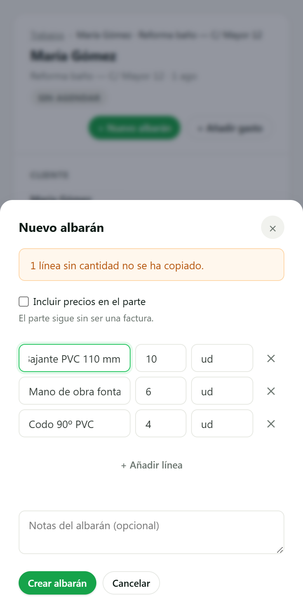
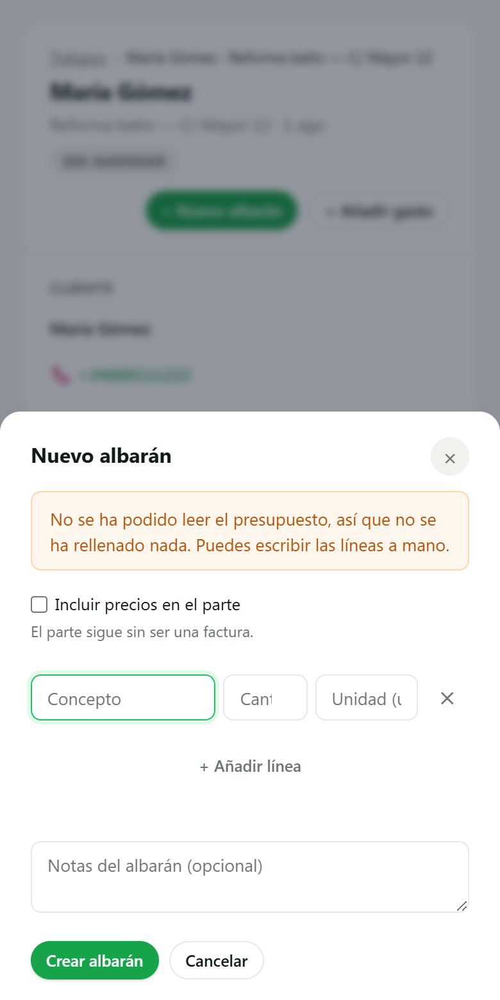
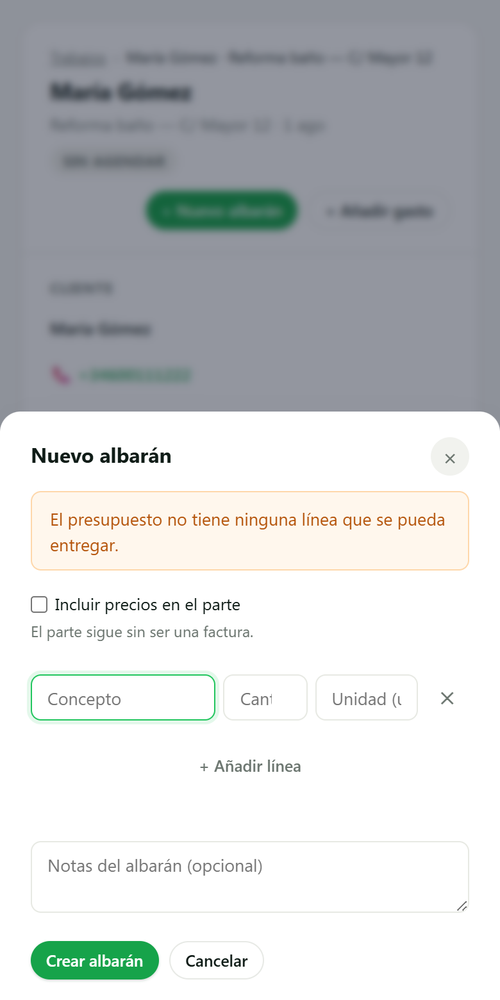
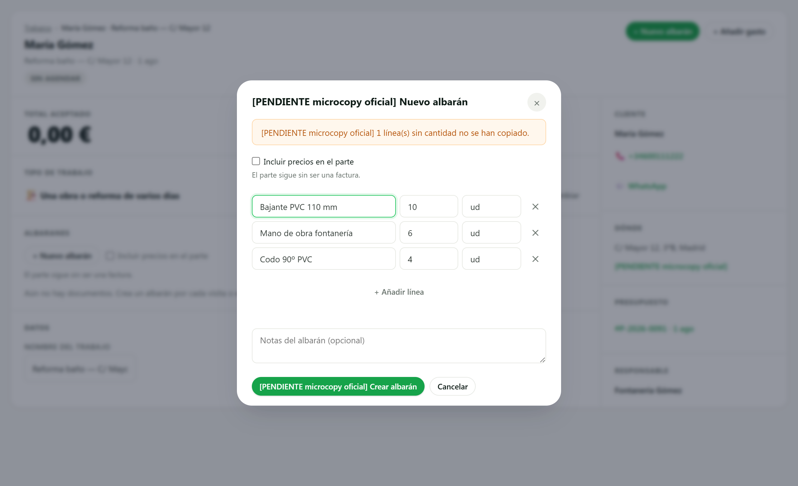
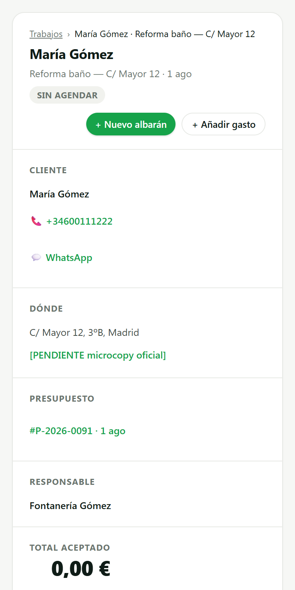

# SCRUM-303 (C4) · capturas de la hoja de crear albarán (AB6)

**Medido contra:** `origin/main` = `7ce53c31d9fc7d9a0093b13868beaddeeea65dcb` · 2026-08-05T16:07:45+01:00

Producidas con un **banco aislado** (puppeteer-core sobre el Edge instalado + servidor estático
efímero sirviendo `public/`). Se cargan **los 41 scripts que carga `dashboard/index.html`, en su
orden**, y se llama a la vista REAL (`renderJobDetailView`) con `apiRequest` sustituido. Después se
pulsa el botón «+ Nuevo albarán» de verdad. **Sin BD, sin auth, sin servidor de la app, sin
producción.** El banco no se commitea: vivió en el scratchpad.

> **Cargar «los scripts que parecen necesarios» no vale**: `esc` vive en otro fichero y la primera
> tanda fotografió un `ReferenceError` en vez de la pantalla.

> El banco **arranca con un suelo**: si `.modal-overlay` no computa `position: fixed`, para y no
> informa. Una captura sin CSS es una captura de otra cosa (lección de SCRUM-350).

## 🔴 Lo que encontró la captura y la suite no

La primera tanda salió **sin el aviso**. `styles.css:1653` esconde `.alert` cuando no lleva
modificador de color:

```css
.alert:not(.success):not(.ok):not(.error):not(.info):not(.warning) { display: none; }
```

El banner se creaba con `className = 'alert'` a secas, así que **existía en el DOM y no se veía**.
Los tests estaban en verde porque comprueban que el motivo y su texto EXISTEN, no que lleguen a la
pantalla — el mismo fallo que `validarLineas` comiéndose el campo en SCRUM-367: el mecanismo en su
sitio, y vacío. Ahora hay tono obligatorio y un guard que **deriva de la hoja de estilos** qué
modificadores quedan visibles.

## El caso bueno — 390 px (iPhone estándar)

La hoja se abre **ya rellena** con las 3 líneas aprovechables del presupuesto, y avisa de la 4ª
(cantidad 0) que no se copió. **Todavía no existe ningún albarán**: si se cierra aquí, no queda
documento ni hueco en la serie.



## Las dos caras del suelo — misma pantalla vacía, mensajes opuestos

Es la decisión del fundador de esta sesión: **se crea igualmente** —un pro con mala cobertura no
puede quedarse sin poder crear el documento— pero el producto **no miente** sobre por qué está
vacía.

| No se pudo LEER el presupuesto | El presupuesto NO TENÍA líneas |
|---|---|
|  |  |

## Escritorio — 1280 px



## La pantalla antes de abrir la hoja



## Checklist AB6

| Punto | Estado |
|---|---|
| Componentes | `.modal-overlay` / `.modal` / `.alert` / `.input` / `.btn-primary` / `.btn-secondary` del inventario AB3. **Cero componentes nuevos, cero tokens nuevos** |
| Focus visible | Sí — anillo en el primer campo, visible en las cuatro capturas |
| Targets ≥44 px | Heredados del editor de líneas, que ya cumplía |
| Estados empty / error | **Los dos casos vacíos son el corazón del ticket** y están capturados; el error del guardado usa el banner propio del sheet (`.alert error`), que ya existía |
| Textos largos | El microcopy va con el marcador `[PENDIENTE microcopy oficial]` (29 caracteres) **delante del texto**, así que lo capturado es el caso PEOR de longitud: el aprobado será más corto |
| Contraste AA | Tonos `info`/`warning` de `styles.css`, sin colores inventados |

### Huecos declarados

- **Matriz de dispositivos (V0-5): HUECO.** Hay 390 px y 1280 px. **No hay Android de gama media,
  ni tablet, ni iPhone real**: el banco es Edge de escritorio con el viewport redimensionado, que
  no prueba fuentes del sistema, teclado en pantalla ni barra de navegador.
- **Loading**: la hoja se abre después de leer el presupuesto y esa lectura no tiene skeleton. Con
  red lenta el botón queda deshabilitado sin señal. No estaba en el alcance y no se ha tocado.
- **Merchant sin logo · cliente sin WhatsApp · demo con marca de agua**: no aplican a esta hoja
  (no pinta ni logo, ni teléfono, ni marca).
