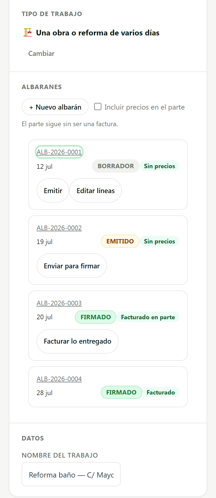
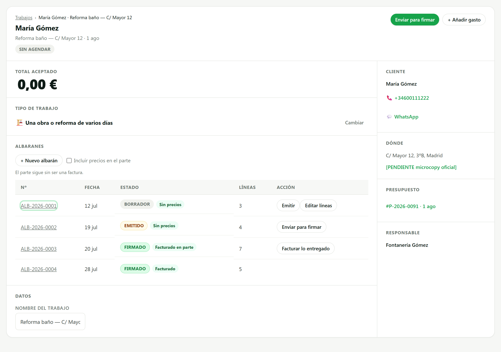
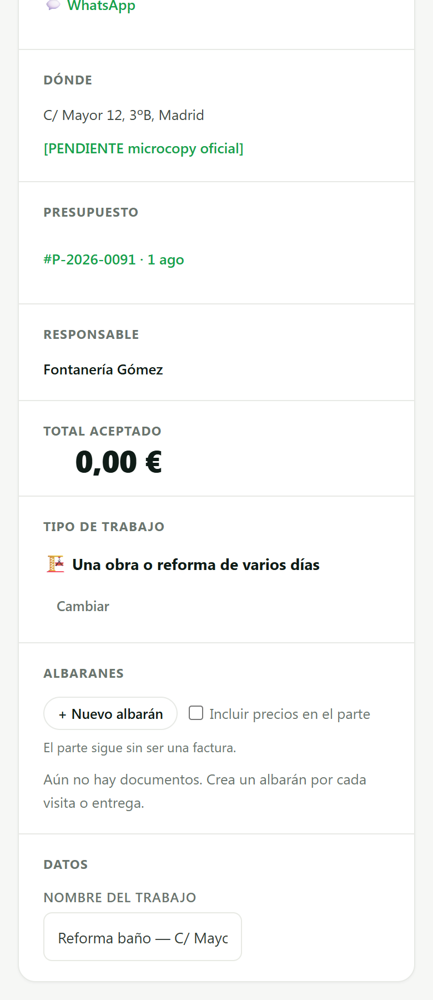

# SCRUM-304 (C3) · capturas de la tabla de albaranes (AB6)

**Medido contra:** `origin/main` = `e2f397aa69a93f5ddf017a62a5865da35fad605f` · 2026-08-05T17:28:31+01:00

Banco aislado (puppeteer-core sobre el Edge instalado + servidor estático efímero sirviendo
`public/`), con los **41 scripts que carga `dashboard/index.html` en su orden** y la vista REAL
(`renderJobDetailView`) con `apiRequest` sustituido. Sin BD, sin auth, sin servidor de la app, sin
producción. El banco no se commitea: vivió en el scratchpad.

**Suelo del banco:** la tabla tiene que existir, computar `border-collapse: collapse` (o sea, con su
CSS de verdad) y traer **una fila por albarán**. Si no, para y no informa.

## Los cuatro casos de la columna Acción, en una sola pantalla

| Albarán | Estado | Acción |
|---|---|---|
| ALB-2026-0001 | `borrador` | **Emitir** (navega al detalle) + `Editar líneas` |
| ALB-2026-0002 | `emitido` | **Enviar para firmar** (navega) |
| ALB-2026-0003 | `firmado` · facturado **a medias** | **Facturar lo entregado** (ejecuta aquí) |
| ALB-2026-0004 | `firmado` · facturado del todo | **(vacía)** — C2 dice que no hay siguiente paso |

## 390 px — cada fila es una CARD, no una tabla

### 🔴 La medición que ahorró la tercera amputación

Tras dos rondas quitando columnas seguíamos a **125 px** de que `Acción` entrara. En vez de amputar
la tercera, la pregunta que no se había hecho: **¿qué forma tiene una lista de esta familia a 390 px
en el resto del producto?**

**EL PATRÓN YA EXISTÍA**, y hay dos:

| Patrón | Para | Quién lo usa |
|---|---|---|
| `.table--cards-mobile` | listas **con dinero** | `albaranesView.js` · `invoicesView.js` · `quotesListView.js` |
| `.table--stack-mobile` | tablas **simples** | `customersView.js` · `providersView.js` · `templatesView.js` |

Se elige **`.table--cards-mobile`** porque es el que usa `albaranesView.js` —C1 (SCRUM-301), la
lista global del **mismo documento**—. Dos formas móviles para el mismo albarán según la pantalla
sería SCRUM-240 en la capa visual.

Por debajo de 640 px la cabecera se oculta y cada fila se recompone como card: **no hay columnas que
repartir**, así que el problema de ancho desaparece en vez de resolverse quitando información.

### Antes y después, medido

| A 390 px | Antes del patrón | Con el patrón |
|---|---|---|
| Borde derecho de la celda Acción | 515 px (viewport 390) | **324 px** |
| ¿Entra sin scrollear? | 🔴 NO, faltaban 125 px | ✅ **SÍ**, 66 px de holgura |
| Botones de acción | 30 px | ✅ **44 px** |

**Las dos amputaciones se revirtieron:** `Fecha` y `Líneas` vuelven. Y las dos palancas aprobadas
—quitar Fecha en móvil, acortar el rótulo— **no hicieron falta**: no se aplicó ninguna.

### El número se enseña ENTERO

Se descartó acortarlo a «0001»: que el año y la serie se repitan en todas las filas es verdad **hoy
con estos datos, no por diseño**.

### 🔴 La convención de las ranuras: se DERIVÓ, no se eligió

La primera versión puso el número en `cell-client` y el **conteo de líneas** en `cell-id` — una
**tercera convención** para las mismas ranuras. En la card eso salía como un «3» suelto arriba, sin
etiqueta, porque el patrón oculta la cabecera.

Medido en las otras dos vistas que usan el mismo patrón:

| Ranura | `invoicesView.js` | `quotesListView.js` |
|---|---|---|
| `cell-id` | `tdNumber` ([:354](../../public/dashboard/js/invoicesView.js#L354)) | `tdId` ([:194](../../public/dashboard/js/quotesListView.js#L194)) |
| `col-hide-mobile` | la Fecha ([:392](../../public/dashboard/js/invoicesView.js#L392)) | el Método ([:217](../../public/dashboard/js/quotesListView.js#L217)) |

O sea: **`cell-id` es la ranura del NÚMERO del documento**, y lo informativo que no acciona se
oculta en móvil con `col-hide-mobile`. Aplicado aquí igual: el número a `cell-id`, y `Líneas` a
`col-hide-mobile` — en escritorio la rotula su columna, y en la card no aparece suelta.

**Por eso no hizo falta la microcopy aprobada «Líneas» para la card:** el problema no era que
faltara un rótulo, era que ese valor estaba en la ranura del número. `Líneas` sigue rotulando su
columna en la tabla de escritorio.

**Y la tarjeta no creció:** con el número en su sitio y `Líneas` fuera, la card a 390 px tiene una
línea MENOS que antes. Se ve en la captura.

### Foco y targets: MEDIDOS, y el patrón arregló la mitad

| | Antes | Con el patrón | AB6 |
|---|---|---|---|
| Anillo de foco | SÍ | SÍ (visible sobre ALB-2026-0001) | ✅ |
| Botones de acción | 30 px | **44 px** | ✅ |
| Enlace del número (`.detail-miga-link`) | 20 px | **20 px** | 🔴 < 44 |

Los botones se arreglaron **solos** al cambiar de forma: `cell-actions` trae `min-height: 44px`. El
enlace del número **no**, porque no cae en esa ranura: sigue para el censo de los 139 conjuntos.

## Escritorio — 1280 px, sigue siendo tabla

## Estado vacío — sin albaranes NO se pinta la tabla

El texto es el que ya existía de G4: no se ha tocado.

## Checklist AB6

| Punto | Estado |
|---|---|
| Componentes | `.table` / `.table-scroll` / `.table--cards-mobile` / `.status-pill` del inventario AB3. **Cero componentes nuevos, cero tokens nuevos** |
| Estados empty | ✅ capturado |
| Focus visible | ✅ **medido** |
| Targets ≥44 px | ✅ **medido** en las acciones · 🔴 el enlace del número sigue en 20 px |
| Responsive 390 px | ✅ **cumple**: cada fila es una card, sin scroll lateral |
| Contraste AA | Pills y tabla con los tonos existentes, sin colores inventados |

### Huecos declarados

- **Matriz de dispositivos (V0-5): HUECO.** Hay 390 px y 1280 px. **No hay Android de gama media,
  ni tablet, ni iPhone real**: el banco es Edge de escritorio con el viewport redimensionado, que no
  prueba fuentes del sistema, teclado en pantalla ni barra de navegador.
- **`albaranesView.js` marca `.table--cards-mobile` pero NO pone las clases `cell-*`**, así que su
  rejilla de card no llega a usarse. Medido de paso; es otro carril (regla 9) y no se toca.
