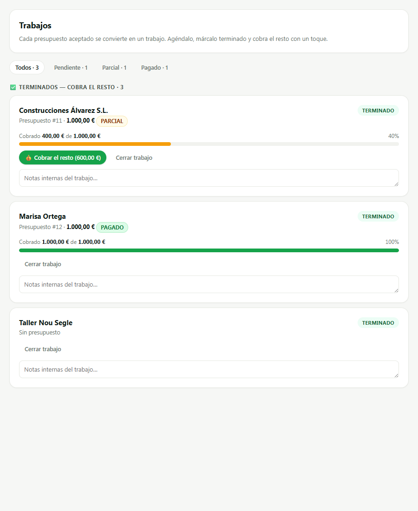
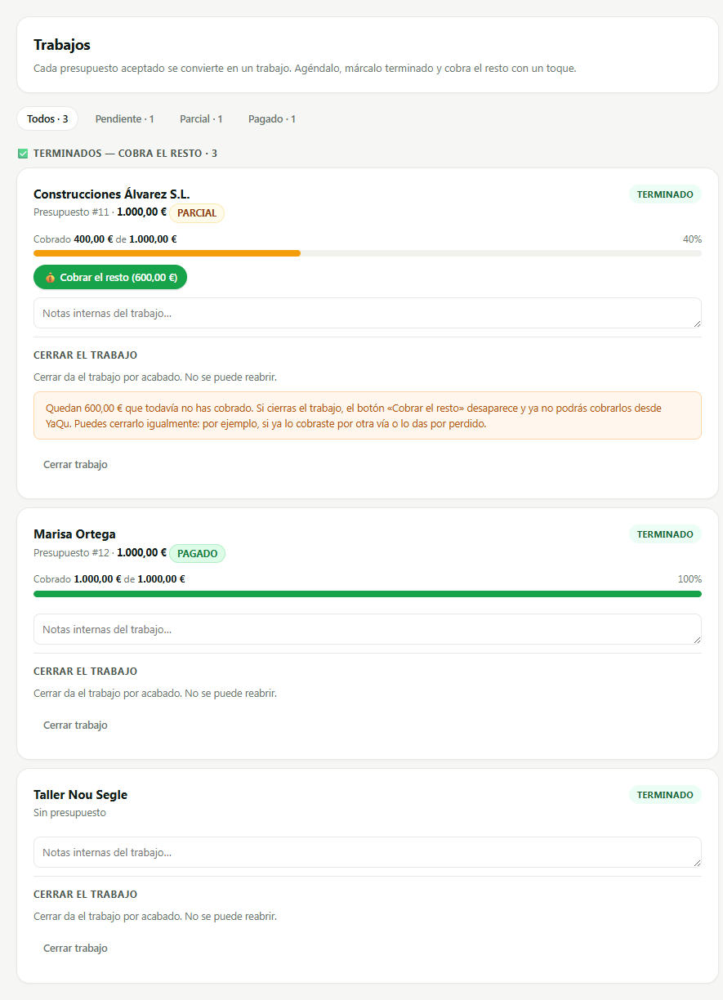
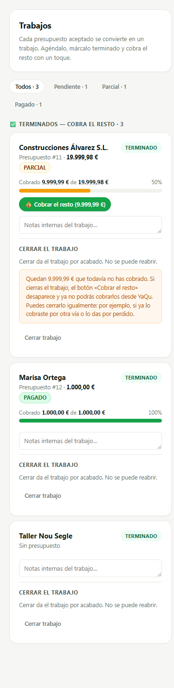

# SCRUM-344 · capturas del aviso al cerrar un Trabajo (AB6)

**Medido contra:** `origin/main` = `74c6270f7f8ede9faedc8aa81c7951ee4d1e4a58` · 2026-08-05T05:31:31+01:00

Producidas con un **harness aislado** (Playwright sobre un servidor estático efímero): se cargan
`api.js` + `jobsCierreTrabajo.js` + `jobsView.js`, se stubea `fetch`/`apiRequest` con tres Trabajos
de mentira con la forma EXACTA que devuelve `serializeJob` (`jobs.routes.ts:136-174`) y se llama a
`renderJobsView`. **Sin BD, sin auth, sin servidor de la app, sin producción.** El harness no se
commitea: vivió en el scratchpad y el servidor se paró al terminar.

El **antes** no es una reconstrucción: son los bytes de `public/dashboard/js/jobsView.js` en
`origin/main`, servidos tal cual (`git show origin/main:… > jobsView.antes.js`).

Los tres Trabajos son los tres casos que decide la regla, y están a propósito en la misma pantalla:

| # | Cliente | Situación | ¿Avisa? |
|---|---------|-----------|---------|
| 1 | Construcciones Álvarez S.L. | `totalAceptado` 1.000 · cobrado 400 · **600 € por facturar** | **Sí** |
| 2 | Marisa Ortega | todo facturado y cobrado (`remaining: null`) | No |
| 3 | Taller Nou Segle | `totalAceptado: null`, sin presupuesto — el degenerado | No |

## ANTES — «Cerrar trabajo» al lado de «Cobrar el resto», sin nada que lo explique

Ahí está el defecto entero, visible: el botón que **mata** la vía de cobro se ofrece como IGUAL del
que la usa, en el mismo renglón, con el mismo peso, y sin una palabra. Los 600 € que el botón verde
dice que quedan por cobrar desaparecen con el clic de al lado. Es `jobsView.js:231`.

Y fíjate en el tercero: **también ofrece cerrar exactamente igual**, sin presupuesto y sin importe.
La pantalla no distingue hoy entre «te deben 600 €» y «aquí no hay nada que cobrar».

## DESPUÉS — sección propia al pie, y el aviso solo donde hay algo que perder

* **Tarjeta 1** — sección propia con su explicación **y la banda ámbar con los `600,00 €` DENTRO de
  la frase**: el MISMO número que enseña el botón «Cobrar el resto (600,00 €)» de arriba, del mismo
  campo (`remaining.amount`) y con el mismo `fmtMoneyEs`. No es un segundo cálculo que pueda
  separarse del primero.
* **Tarjetas 2 y 3** — la sección explica qué es cerrar, pero **no hay banda y no hay confirmación**:
  cerrar sigue siendo un clic. La 3 es la que demuestra que el disparador no es el semáforo: su
  `estadoCobro` es `'Pendiente'`, igual que el de un Trabajo que te debe todo, y aun así no avisa.

**Comprobado en el navegador, no solo en el AST** (`page.evaluate`, clic real en los tres botones):
**1 confirmación** —«Quedan 9.999,99 € sin cobrar. Al cerrar el trabajo ya no podrás cobrarlos desde
YaQu. ¿Cerrar de todas formas?»— y **2 PATCH** enviados. La tarjeta que avisaba, contestando «no»,
**no mandó nada**; las dos sin saldo pasaron directas. Las dos caras, medidas. Altura del botón de
cerrar: **44 px en las tres** (AB6, objetivo al pulgar — `btn-sm` solo llega a 30).

## 390 px con importes grandes (9.999,99 € de 19.999,98 €)

Medido en el navegador a este ancho: `scrollWidth === clientWidth`, **la página no desborda en X**.
El aviso envuelve a cinco líneas y el importe no parte. La sección hereda el ancho de la tarjeta sin
CSS propio: el único componente que añade es `.alert.warning`, que ya está en el inventario AB3.

---

**La microcopy está APROBADA por el fundador** (5-ago-2026, regla 30) y fijada carácter a carácter en
`tests/scrum344-cierre-con-saldo.test.mjs`: cambiar un punto por una coma sale rojo. Son cinco
ranuras — `titulo`, `boton`, `explicacion`, `avisoSaldo` y `confirmar`.

`titulo` y `boton` se separaron **al mirar esta captura**, no al escribir la especificación: con una
sola ranura el encabezado y el botón decían lo mismo y la sección parecía repetirse.

El texto **no nombra el documento fiscal** —ni «factura», ni «justificante», ni «recibo»— y eso tiene
guard propio. Un merchant ES sin `INVOICING_ES_ENABLED` recibe un justificante (Parte M) y este copy
lo lee él. ⚠️ Ojo al comprobarlo: el trinquete de SCRUM-299 **excluye `public/dashboard/` a
propósito**, así que un verde de `npm test` no habría probado nada — las frases se pasaron por
`promesasDeFactura` directamente.

---

**HUECO PENDIENTE (humano, del fundador, por bloque):** la **matriz de dispositivos reales**
(Android gama media / iPhone / tablet, V0-5). No se finge y no se da por hecha: estas capturas son de
un navegador de escritorio redimensionado, que no sustituye a un dispositivo real.
