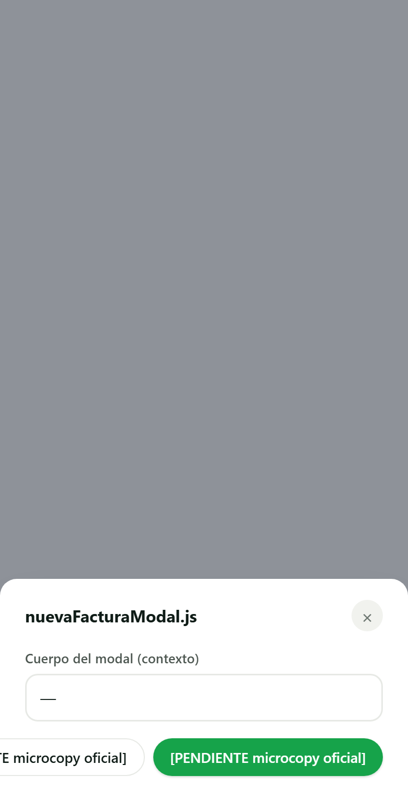
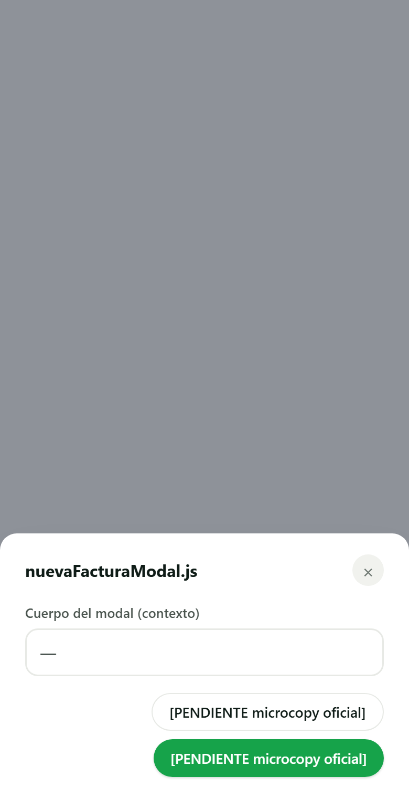
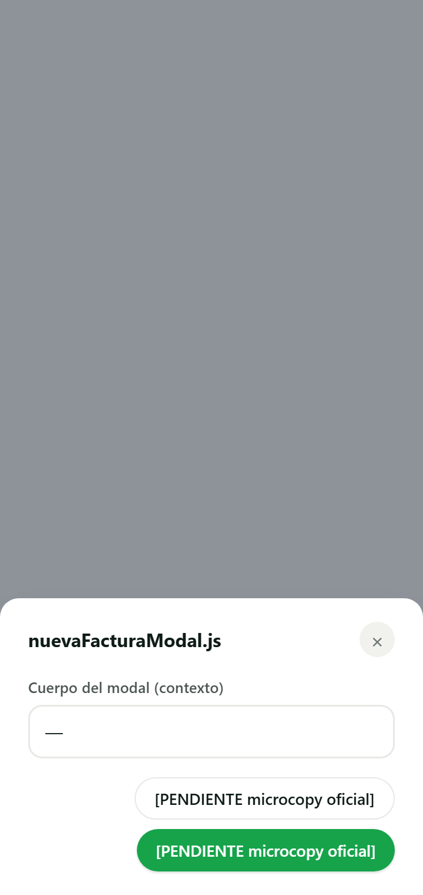
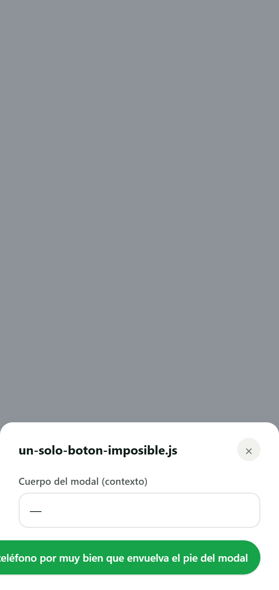

# SCRUM-350 · capturas del pie de modal (AB6)

**Medido contra:** `origin/main` = `74c6270f7f8ede9faedc8aa81c7951ee4d1e4a58` · 2026-08-05T05:38:32+01:00

Producidas con un **banco aislado** (puppeteer-core sobre el Edge instalado + servidor estático
efímero sirviendo `public/`). Cada pie del censo se monta dentro de **su modal real** —clase y
`style` en línea incluidos— con `tokens.css` y `dashboard/css/styles.css` de verdad. **Sin BD, sin
auth, sin servidor de la app, sin producción.** El banco no se commitea: vivió en el scratchpad.

> El banco **arranca con un suelo**: si `.modal-footer` no computa `display:flex` y
> `padding: 0px 24px 20px`, para y no informa. Está ahí porque la primera tanda dio «no desborda»
> en los diez pies — la página se montaba con `setContent()` y **se pintaba sin CSS**, donde un
> `display:block` con botones en línea envuelve solo. Un cero de «no desborda» y uno de «no supe
> mirar» son el mismo número.

## El caso peor: `nuevaFacturaModal.js:171`

Es el único de los diez que rompe. Los dos botones llevan el marcador
`[PENDIENTE microcopy oficial]` (29 caracteres, regla 30).

### 390 px — iPhone estándar

Antes, el primer botón empieza en **x = −83**: sale de la pantalla por la izquierda, y como el
pie alinea a `flex-end` no hay scroll que lo alcance.

| ANTES | DESPUÉS |
|---|---|
|  |  |

### 360 px — donde de verdad aprieta

Antes, **x = −113**.

| ANTES | DESPUÉS |
|---|---|
|  | 

## La otra cara: los que hoy caben no se mueven

Es el riesgo de este cambio. `flex-wrap: wrap` es un **no-op cuando los botones entran en una
línea**, y eso se comprueba comparando los PNG por SHA-256, no mirándolos:

**18 de las 20 capturas (10 pies × 2 anchos) son idénticas byte a byte. Las 2 que cambian son las
del pie roto.**

Aquí van las dos que más riesgo tenían de moverse.

### Presupuesto rápido (`homeView.js:723`) — holgura **0 px** a 360, y con reglas propias

El más justo de los que caben, y el único con su propio bloque en `styles.css` (`.qq-modal`, que
a ≤639 px pone los botones a ancho completo y en `column-reverse`). Si algo iba a chocar con un
cambio en el contenedor compartido, era éste.

| ANTES (360) | DESPUÉS (360) |
|---|---|
|  |  |

### Editar cliente (`customerDetailView.js:326`) — el más justo de los ordinarios

Holgura 82 px a 360. Pie compartido sin reglas propias.

| ANTES (360) | DESPUÉS (360) |
|---|---|
|  |  |

## Control negativo

Con el arreglo YA puesto, un pie con **un solo botón imposible de encajar** (rótulo más ancho que
el modal) sigue midiendo **1 botón fuera**. Sin esto, el «0 fuera» de la columna DESPUÉS podría
significar «el detector se rompió» en vez de «ya no desborda».

Es también el límite que este ticket **no** arregla y deja dicho: `.btn*` lleva
`white-space: nowrap`, así que un rótulo suelto más ancho que el pie no lo salva envolver la
fila. Hoy no pasa — el botón más ancho mide 220 px y el hueco a 360 px es de 312.

## Tabla completa (SHA-256 de los 16 primeros hex)

| pie | ancho | ANTES | DESPUÉS | |
|---|---|---|---|---|
| customerDetailView.js:326 | 360 | `26b098137336176e` | `26b098137336176e` | idéntica |
| customerDetailView.js:326 | 390 | `ace609f6ba34e61d` | `ace609f6ba34e61d` | idéntica |
| customersView.js:189 | 360 | `ed4bd357b34a4378` | `ed4bd357b34a4378` | idéntica |
| customersView.js:189 | 390 | `6f9cb0d91328e45f` | `6f9cb0d91328e45f` | idéntica |
| expensesView.js:319 | 360 | `e347d4d5d8292e33` | `e347d4d5d8292e33` | idéntica |
| expensesView.js:319 | 390 | `ceac7d7d08e59b88` | `ceac7d7d08e59b88` | idéntica |
| homeView.js:723 | 360 | `de83b01b626a6b88` | `de83b01b626a6b88` | idéntica |
| homeView.js:723 | 390 | `0f66adda929956e9` | `0f66adda929956e9` | idéntica |
| jobDetailView.js:1054 | 360 | `945d5fc047294288` | `945d5fc047294288` | idéntica |
| jobDetailView.js:1054 | 390 | `2331b9184411a840` | `2331b9184411a840` | idéntica |
| **nuevaFacturaModal.js:171** | **360** | `afc0d15b3e650f22` | `a9db32e2151e902c` | **cambia** |
| **nuevaFacturaModal.js:171** | **390** | `4433e4aedfc14fee` | `eba3b32c74fc5239` | **cambia** |
| productsView.js:125 | 360 | `8fd973c8a60fbca8` | `8fd973c8a60fbca8` | idéntica |
| productsView.js:125 | 390 | `a191854b5ada2ccb` | `a191854b5ada2ccb` | idéntica |
| providersView.js:61 | 360 | `3b417ec712fda47b` | `3b417ec712fda47b` | idéntica |
| providersView.js:61 | 390 | `635a3138900a83ec` | `635a3138900a83ec` | idéntica |
| quotesView.js:163 | 360 | `82fcd0bd31d6d4fb` | `82fcd0bd31d6d4fb` | idéntica |
| quotesView.js:163 | 390 | `97b898e7870ee173` | `97b898e7870ee173` | idéntica |
| quotesView.js:1939 | 360 | `f0dab63f19a08a8a` | `f0dab63f19a08a8a` | idéntica |
| quotesView.js:1939 | 390 | `637ba54e84df03c5` | `637ba54e84df03c5` | idéntica |

## Nota para quien aterrice la microcopy de SCRUM-289

Cuando el marcador `[PENDIENTE microcopy oficial]` se sustituya por el rótulo aprobado, **hay que
volver a mirar este pie**. Que quepa con un texto concreto no arregla el contenedor — lo que lo
arregla es este ticket, y por eso el orden importa: con esto puesto, el rótulo final puede caber
en una línea o no, y en ninguno de los dos casos se sale de la pantalla.

---

**HUECO PENDIENTE (humano, del fundador, por bloque):** la **matriz de dispositivos reales**
(Android gama media / iPhone / tablet, V0-5). No se finge y no se da por hecha: estas capturas
son de un navegador de escritorio redimensionado a 390 y 360 px, que no sustituye a un
dispositivo real.
