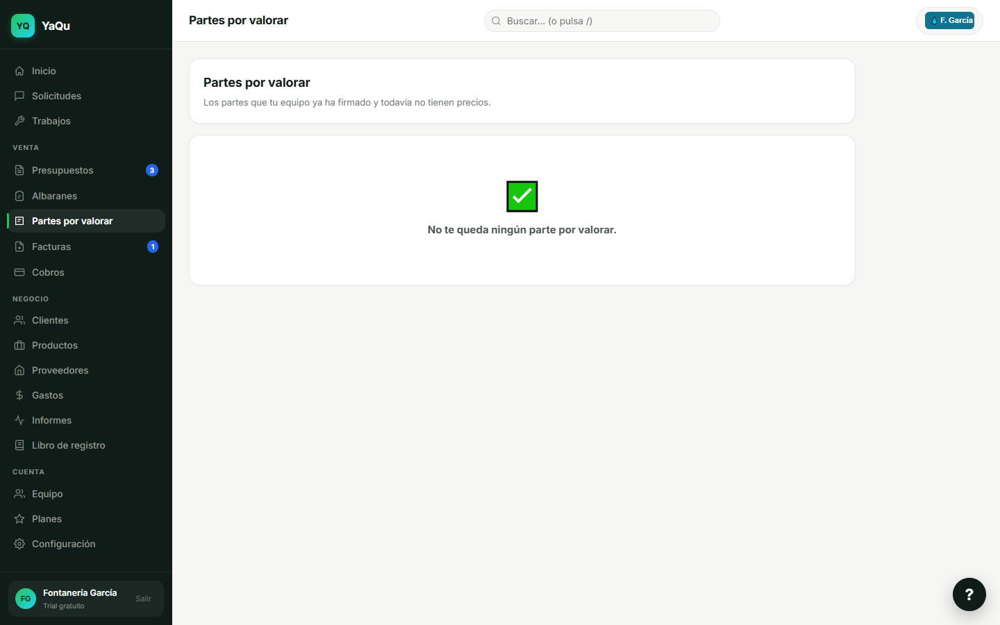
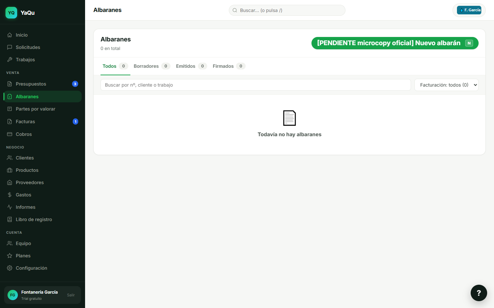
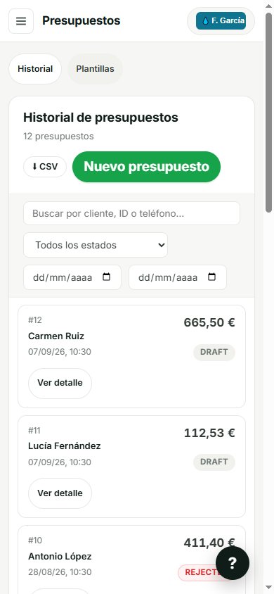
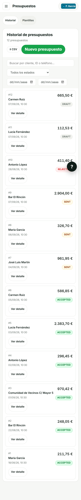
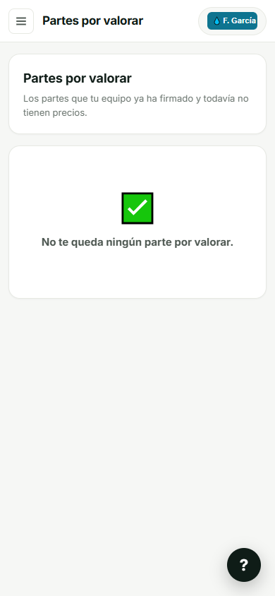

# Sesión 6 — recorrido ENTRE vistas (Playwright MCP) · 7-sep-2026

## Contexto de la medición (sin esto, dos mediciones honestas se contradicen)

| Qué | Valor |
|---|---|
| Commit medido | `af08201502a3978a484de3933132dfcdf26df790` |
| `origin/main` al medir | `af0820150…` (idéntico) — `fetch` propio, 2026-09-07T11:52:22Z |
| Producción servía | el MISMO commit (`GET /version` y `/health`) |
| Dónde | banco LOCAL, base propia recién creada en Postgres portátil de loopback |
| Integraciones salientes | **cero** definidas (WhatsApp, Stripe, Resend, IA sin clave) |
| Pieles | escritorio 1440×900 · móvil **390×844 con viewport real** |
| Control del viewport | `innerWidth=390` y `matchMedia('(max-width:768px)')` **activa** |
| Sonda A | MCP de Playwright (`page.setViewportSize`), conducida a mano |
| Sonda B | `scripts/capture-demo.mjs`, el banco de la casa (puppeteer-core/Edge) |

⛔ Contra producción **solo lectura**, y solo para saber qué commit sirve. Cero escrituras.

---

## 1 · Navegar por el menú no deja rastro: la URL miente y «atrás» saca de la app

**Daño:** el usuario pierde su sitio sin previo aviso y sin error. Afecta a **17 de 17**
destinos, en **las dos pieles**.

Secuencia medida, con clics reales:

1. Abro `/dashboard/#albaranes` → sale Albaranes. ✔
2. Pulso **«Partes por valorar»** en el menú → sale Partes por valorar…
   **pero la URL sigue diciendo `#albaranes`** y el historial no crece.
3. Pulso F5, que es lo que hace cualquiera → **aparezco en Albaranes.**

Tres caras del mismo fallo, las tres medidas:

- **Recargar te cambia de pantalla** (la de arriba). Si entraste sin hash, F5 te devuelve a Inicio.
- **«Atrás» no deshace una navegación:** 17 clics → `history.length` constante. El botón
  atrás salta fuera del documento entero. En móvil es el gesto de todos los días.
- **Un enlace `#vista` compartido puede no hacer nada:** si la URL ya llevaba ese hash
  (se lo dejó ahí un `replaceState` anterior), no hay `hashchange` y la app no se mueve.
  Medido: `goto('#quotes-list')` estando en Inicio → se queda en Inicio.

**Dónde está**, leído en el fuente: el manejador del menú llama a `renderView` **crudo**
(`public/dashboard/js/app.js`, «Clicks en el sidebar»), no al envoltorio
`window.renderAppView`, que es el único que escribe el hash. Y ese envoltorio usa
`history.replaceState`, nunca `pushState`, así que ni las navegaciones que sí tocan el
hash dejan entrada de historial.

La ironía está en el propio código: `HASH_VIEWS` lleva un comentario que dice *«sin esto,
quien recargue estando en Partes por valorar pierde la vista»*, y añadieron `partes-oficina`
a la lista para evitarlo. Esa protección **no llega a dispararse por el camino normal**,
porque el clic nunca escribe el hash que la lista sabría leer.

> **Control de dos sondas — lo ve SOLO Playwright.** El banco de la casa corrió contra el
> mismo banco local y dio 12 vistas + 2 modales, **cero quejas, DONE**. No es que el banco
> falle: es que **navega poniendo el hash él mismo** (`page.goto(BASE + '#vista')`), así
> que en su mundo el hash y la vista coinciden siempre por construcción. No puede ver esto.
> Descartado que sea montaje mío: reproducido con clics reales (`getByRole().click()`), con
> el mecanismo localizado en el fuente, y con control positivo — navegando por
> `renderAppView` la coherencia sale **17/17**, así que la comprobación distingue.

---

## 2 · Los estados del presupuesto salen en inglés crudo en la lista principal

**Daño:** la pantalla donde el jefe vive dice `DRAFT`, `SENT`, `ACCEPTED`, `REJECTED` a un
profesional español. **12 de 12** filas. Y la app **se contradice a sí misma**: Inicio,
Buscador global y Cliente 360 llaman «Aceptado» al mismo presupuesto que Presupuestos
llama `ACCEPTED` (medido: 0 apariciones en inglés en Inicio).

**Dónde está:** `public/dashboard/js/quotesListView.js`, en `buildStatusPill`. La función
traduce exactamente **dos** estados —`expired` → «CADUCADO» y `pending_approval` →
«PENDIENTE APROBACIÓN»— y todo lo demás cae a `st.toUpperCase()`, o sea al valor crudo del
enum. No es que nunca se tradujera: el mapa español
`{ draft:'Borrador', sent:'Enviado', accepted:'Aceptado', rejected:'Rechazado', … }` ya
existe **tres veces** en el mismo directorio (`homeView.js`, `globalSearch.js`,
`customerDetailView.js`). La lista principal es la que no lo usa.

> **Control de dos sondas — lo ven LOS DOS.** El banco de la casa lo tiene fotografiado en
> `05-quotes-list.png` con los mismos cuatro rótulos en inglés. Según la regla: si las dos
> sondas lo ven, es defecto del producto.

---

## 3 · El banco de vistas no fotografía 6 de las 17 pantallas del menú

**Daño:** es el hueco por el que se cuela lo demás. Ninguna captura, ninguna revisión
visual, ningún ojo — nunca — sobre seis secciones enteras.

Medido comparando el menú real con `AUTH_VIEWS` de `scripts/capture-demo.mjs`:

- destinos en el menú: **17**
- vistas del banco: **12** (y una de ellas, `quotes-new`, ni siquiera está en el menú)
- **sin fotografiar (6):** `jobs`, `albaranes`, `partes-oficina`, `cobros`,
  `libro-registro`, `plans`

Es decir: **la cadena Tecnosel entera** (Trabajos → Albaranes → Partes por valorar), más
Cobros y el Libro de registro. `partes-oficina` —la pantalla del hallazgo 1— está
justo ahí dentro.

**Y es exactamente el fallo que la casa ya tiene diagnosticado, en la lista que nadie
vigiló.** El comentario de `HASH_VIEWS` avisa: *«ESTA LISTA SE MANTIENE A MANO Y POR ESO SE
QUEDA ATRÁS»*, y le pusieron guard — `HASH_VIEWS` aparece en **5** ficheros de `tests/` y
hoy cubre los 17 destinos. `AUTH_VIEWS` es la **cuarta** lista a mano, y tiene **cero**
tests. Es la única sin red, y es precisamente la que decide qué se mira.

---

## Fuera de los tres (por daño menor, pero anotado)

- **`teamView.js:213` — `TypeError: Cannot set properties of null`.** Toca
  `document.getElementById('btn-invite-member')` **después** de un `await loadMembers()`:
  si sales de Equipo mientras carga, el nodo ya no existe y salta un error no capturado.
  Medido: al volver a Equipo con calma, el botón queda bien cableado y funciona — daño
  real hoy = ruido en consola. Se anota porque el patrón (tocar el DOM tras un `await`
  sin comprobar que sigues en la vista) sí puede morder más fuerte en otra pantalla.
- **`[PENDIENTE microcopy oficial]` está vivo en producción**, incluido el botón primario
  de Albaranes. **No es un defecto**: es la convención de la regla 30 (microcopy sin
  aprobar sale marcado, con guards que lo sostienen). Se menciona solo por superficie:
  son ~24 ficheros del panel, y el fundador quizá no lo tenga medido.

---

## Lo que se conserva de esta tanda

- `scripts/recorrido-entre-vistas.mjs` — la sonda que **recorre** en vez de fotografiar.
  Entra una vez y se mueve haciendo clic, y tras cada clic pregunta si la URL, el título y
  el historial saben dónde está. Trae su propio **control positivo del viewport** (si la
  media query de móvil no se aplicó, aborta en vez de medir otra cosa).
  Ejecutada contra este banco: **17/17 incoherentes en las dos pieles**.
- **Límite honesto:** está escrita en `puppeteer-core` porque meter Playwright sería
  dependencia nueva (regla 36, pide OK del fundador). O sea que **comparte motor con el
  banco de la casa**; lo que no comparte es el método. Para el control de dos sondas de
  verdad sigue haciendo falta conducir el MCP a mano.
- **Trampa medida, para no perder otra tanda:** `html { scroll-behavior: smooth }` cuelga
  el `click()` de Playwright en *«scrolling into view if needed»* aunque el elemento esté
  dentro del viewport y nada lo tape. **No es defecto del producto.** Un dedo humano no se
  entera. Si un clic caduca ahí, mirar esto antes de escribir un hallazgo.

## Cómo levantar el banco otra vez

1. Worktree **al día** (`origin/main`): el checkout principal iba **2.817 commits atrás**
   (31-jul) y su `node_modules` genera el cliente Prisma del esquema viejo.
2. `node_modules` **propio** (copia, no junction): `prisma generate` sobre el compartido
   rompería a las sesiones vecinas.
3. Base nueva en el Postgres portátil de loopback + `scripts/preview-migracion.mjs`
   (veredicto aditivo) + `db push`. Ni prod (`autorack`) ni staging (`acela`) — comprobado
   con `describirBD`, sin imprimir ninguna URL.
4. `.env.local` mínimo: **ninguna** clave de integración → todo lo saliente queda muerto.
5. Sembrar con `prisma/seed.ts` (crea el merchant 1) y **después** `scripts/seed-demo.mjs`
   — en ese orden: el demo hace `update` y aborta si el merchant 1 no existe.
